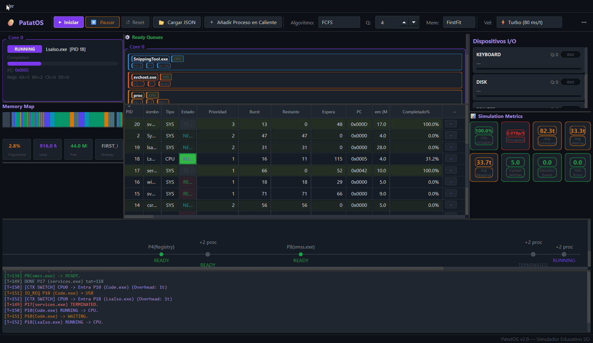

# Simulador de Sistema Operativo

<p align="center">
  
</p>

## 👥 Integrantes

* Candia Usca, Zhaid Genaro - 20241096K
* Morales Quispe, Rodrigo - 20241215J
* Pérez López, Tom Jordan - 20240376J
* Reyes Campos, Ricardo Gaspar - 20244014E 


## 📂 Estructura del Repositorio

```text
Proy_SO_2026_1/
├── .gitignore                   # Archivos y carpetas ignorados por Git
├── README.md                    # Documentación principal del proyecto
├── backend/                     # Motor de la lógica interna hecho en C++
├── docs/                        # Documentación adicional, informes o manuales del proyecto
├── frontend/                    # Constructor del input y del GUI hecho en Python
└── shared_data/                 # Archivos json de nexo entre frontend y backend
```

```text
backend/
├── CMakeLists.txt               # Configuración de compilación
├── escenario_modelo.json        # Escenario de prueba
├── include/
│   └── nlohmann/                # Librería JSON (header-only)
└── src/
    ├── main.cpp                 # Punto de entrada
    ├── simulator.hpp/.cpp       # Orquestador principal
    ├── scheduler.hpp/.cpp       # Planificador (6 algoritmos)
    ├── dispatcher.hpp/.cpp      # Despachador (cambio de contexto)
    ├── memory_manager.hpp/.cpp  # Gestor de memoria
    ├── io_manager.hpp/.cpp      # Gestor de E/S
    ├── error_manager.hpp/.cpp   # Inyección de errores
    ├── json_reader.hpp/.cpp     # Parser de entrada JSON
    ├── json_writer.hpp/.cpp     # Generador de salida JSON
    ├── pcb.hpp                  # Estructura del PCB
    └── types.hpp                # Tipos, enums y configuración
```

```text
frontend/
├── main.py                      # Punto de entrada
├── simulation/
│   ├── clock.py                 # Reloj de simulación (QTimer)
│   └── config.py                # Configuración de hardware
└── ui/
    ├── styles.py                # Tema visual oscuro (QSS)
    ├── config_dialog.py         # Diálogo de configuración (5 pestañas)
    ├── main_window.py           # Ventana principal (orquestador UI)
    └── widgets/
        ├── cpu_widget.py        # Panel de núcleos CPU
        ├── memory_widget.py     # Mapa visual de memoria
        ├── io_widget.py         # Panel de dispositivos E/S
        ├── queue_widget.py      # Colas de listos y bloqueados
        ├── pcb_table.py         # Tabla de procesos
        ├── pcb_detail_dialog.py # Diagrama de 5 estados animado
        ├── metrics_widget.py    # Métricas de rendimiento
        ├── timeline_widget.py   # Diagrama de Gantt
        └── log_widget.py        # Log de consola
```
