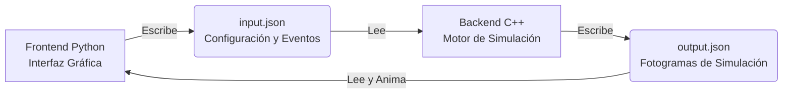

# Flujo Global de Ejecución: PatatOS

Este documento describe de manera general cómo funciona el simulador PatatOS, explicando la interacción entre sus distintos módulos y el ciclo de la simulación.

## Arquitectura

PatatOS se divide en dos componentes principales (Frontend en Python y Backend en C++) que se comunican mediante archivos JSON.

---

## 1. Fase de Configuración (Frontend)

El proceso inicia cuando el usuario ejecuta la interfaz (`main.py`) y configura el entorno en la primera ventana.
- Se definen las características del hardware, el modelo de memoria (Memoria Contigua o Memoria Virtual Paginada) y la E/S.
- Se definen los procesos (manualmente o importando los del sistema operativo host con `psutil`).
- Al hacer clic en "Generar", la interfaz de Python guarda esta información en `shared_data/input.json`.

---

## 2. Fase de Simulación (Backend)

Inmediatamente después de guardar el archivo, Python ejecuta como subproceso el motor compilado en C++ (`simulator.exe`).

- **Lectura:** C++ lee `input.json`.
- **Ejecución y Memoria:** El motor simula internamente el progreso de todos los procesos desde el Tick 0.
  - **Memoria Virtual**: Si se activó la Paginación, la Unidad de Gestión de Memoria (MMU) simula el acceso a la RAM traduciendo las direcciones mediante la TLB y la Tabla de Páginas.
  - **Fallos de Página (Page Faults)**: Si una página no se encuentra en RAM, la MMU dispara una interrupción de Page Fault. El proceso pasa temporalmente a estado `BLOCKED_PAGEFAULT` mientras la página faltante se trae desde el disco (Swap).
  - **E/S Interactiva**: Si un proceso requiere confirmación del usuario (como el teclado), el motor se detiene y pausa temporalmente para esperar el click del usuario.
- **Grabación:** Por cada tick simulado, el motor genera un registro del estado del procesador, de la memoria física y virtual, de los dispositivos, y las métricas acumuladas.
- **Escritura:** Toda la información recolectada se guarda en `shared_data/output.json`. Luego, el proceso de C++ termina.

---

## 3. Fase de Reproducción y Animación (Frontend)

El control regresa a la interfaz gráfica de Python.
- Python lee el archivo `output.json`.
- Inicia un temporizador interno que se actualiza a la velocidad seleccionada por el usuario.
- En cada ciclo del temporizador, la interfaz avanza un fotograma leyendo la información generada y dibujando en pantalla el progreso de los procesos, el visor de Marcos (Frames) en RAM, la ventana de la TLB, el Swap, y los registros de consola.

---

## 4. Interactividad en Tiempo Real

El simulador permite introducir interacciones y cambios mientras la animación se está reproduciendo:
- **Eventos Interactivos (Teclado):** Cuando un dispositivo requiere confirmación del usuario, la interfaz detiene la animación y muestra botones de confirmación.
- **Cambio de Algoritmo:** El usuario puede seleccionar un algoritmo de planificación diferente desde los menús superiores.
- **Inyección de Procesos:** El usuario puede añadir nuevos procesos al hacer clic en "Añadir Proceso en Caliente".

**Manejo de interacciones:**
Al ocurrir cualquiera de estos eventos, Python añade un evento en el archivo `input.json` indicando el tick en que ocurrió la interacción. Seguidamente, vuelve a invocar a `simulator.exe`. El motor C++ lee el nuevo evento, recalcula la simulación a partir de ese tick (o retoma desde el inicio aplicando las nuevas reglas), y sobrescribe el archivo `output.json`. Python entonces recarga el archivo y retoma la animación de forma fluida.
