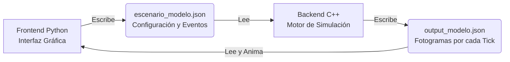
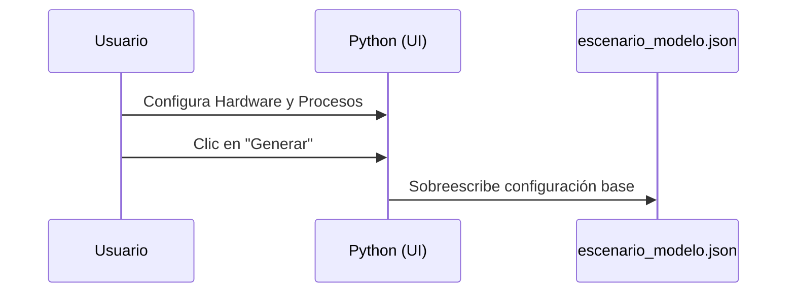
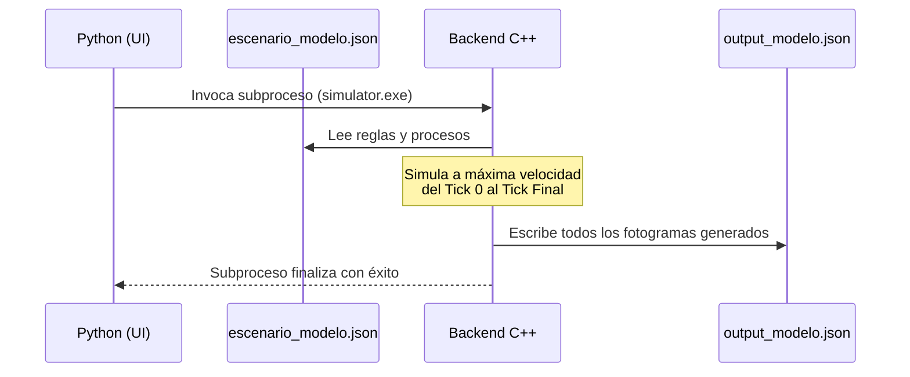
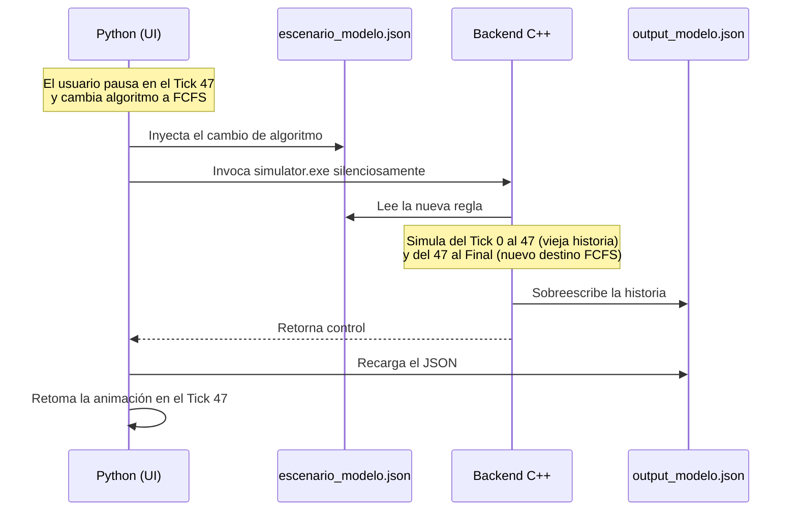

# Flujo Global de Ejecución: PatatOS

Este documento describe a alto nivel cómo funciona el simulador PatatOS, explicando la interacción entre sus distintos módulos y el ciclo de vida de una simulación.

## Arquitectura a Gran Escala

PatatOS está dividido en dos grandes cerebros que se comunican exclusivamente a través de archivos JSON. No hay llamadas a red ni memoria compartida directa.

---

## 1. Fase de Configuración (Frontend)

El ciclo comienza cuando el usuario ejecuta la interfaz en Python (`main.py`) y se abre el **Diálogo de Configuración**.
- El usuario define las características del hardware simulado (algoritmo de CPU, estrategia de memoria, quantum).
- El usuario define los procesos. Puede crearlos manualmente o elegir clonar los procesos reales del sistema operativo anfitrión mediante `psutil`.
- Al dar clic en "Generar", la interfaz en Python empaqueta toda esta información y la guarda en `escenario_modelo.json`.

---

## 2. Fase de Simulación Pura (Backend)

Inmediatamente después de guardar el archivo, Python ejecuta por debajo (como un subproceso invisible) el motor compilado en C++ (`simulator.exe`).

- **Lectura:** C++ lee `escenario_modelo.json`.
- **Ejecución acelerada:** El motor C++ no tiene interfaz gráfica ni pausas. Simula el ciclo de vida completo de todos los procesos desde el Tick 0 hasta que el último proceso termina o se traba.
- **Grabación fotograma a fotograma:** Por cada tick de reloj que transcurre, el C++ "toma una foto" del estado exacto del procesador, de la memoria RAM, de los dispositivos de E/S y de las métricas.
- **Escritura:** Toda esa colección inmensa de fotogramas y bitácoras (`console_logs`) se guarda de golpe en un único archivo enorme llamado `output_modelo.json`. Una vez hecho esto, el motor C++ se cierra silenciosamente.

---

## 3. Fase de Reproducción y Animación (Frontend)

El control vuelve a la interfaz gráfica en Python.
- Python lee el inmenso archivo `output_modelo.json`.
- Arranca un temporizador o *Timer* (cuya velocidad puedes controlar con la barra inferior).
- Por cada "tick" del temporizador en el mundo real, Python avanza un fotograma en la lista cargada, dibujando en pantalla las barras de la memoria, moviendo el diagrama de estados, actualizando el Inspector PCB y mostrando los nuevos `console_logs` generados por el C++.

*Nota: Aunque para el motor C++ toda la simulación ya es historia pasada y ya sabe cómo termina todo, para el usuario que ve la pantalla parece que todo está ocurriendo en tiempo real.*

---

## 4. Fase de Interactividad y Recálculo en Caliente

El simulador permite interactividad en medio de la animación, lo que altera "el destino" que el C++ ya había calculado originalmente:
- **Eventos de Teclado:** Si un proceso solicita `KEYBOARD`, la animación se detiene y la interfaz te hace una pregunta (¿Continuar o Cancelar?).
- **Cambio de Algoritmo:** Si usas la barra superior para cambiar el algoritmo de planificación a la mitad del camino.
- **Inyección de Procesos:** Si haces clic en "Añadir Proceso en Caliente".

**¿Cómo maneja el sistema estos cambios del destino?**

Este ciclo de inyección y recálculo total ocurre en milisegundos, dando la ilusión óptica de que el sistema respondió en caliente a la orden del usuario.
